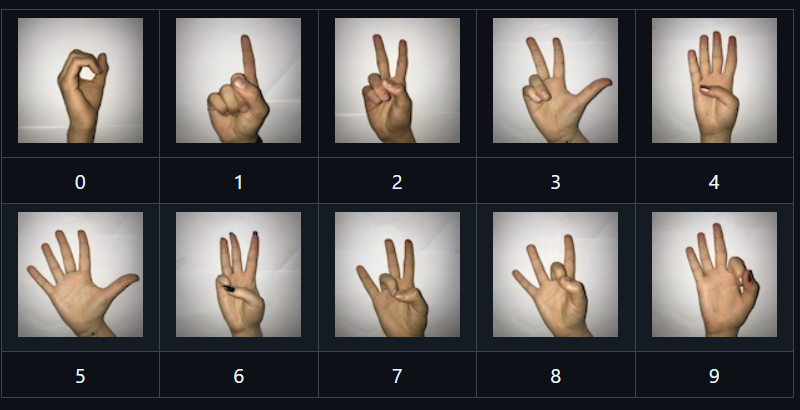

# Fine-Tuned-MobileNet-On-Sign-Language-Digits Documentation

Welcome to the documentation for Fine-Tuned-MobileNet-On-Sign-Language-Digits, a project focused on developing a deep learning model for recognizing sign language digits using a fine-tuned MobileNet architecture.

## Overview

This project aims to create a machine learning model capable of accurately identifying digits (0-9) from sign language gestures. The model is based on the MobileNet architecture, which is a lightweight and efficient convolutional neural network (CNN) designed for mobile and embedded vision applications. By fine-tuning the pre-trained MobileNet model on a dataset of sign language digits, we can adapt the model to recognize patterns specific to sign language digits.

## Dataset Preview:

You can acess the data from [Github](https://github.com/ardamavi/Sign-Language-Digits-Dataset).

## Project Structure

The project is structured as follows:

* `data`: This directory contains the dataset used for training and testing the model. The dataset includes images of sign language digits.
* `src`: This directory contains the source code for the project.
* `model`: This directory contains the implementation of the MobileNet model and any other models used in the project.
* `utils`: This directory contains utility functions used in the project.
* `routs`: This directory contains the routes for the project.
* `views`: This directory contains the views for the project.
* `notebooks`: This directory contains the Jupyter notebooks used in the project.
* `data`: This directory contains the processed and raw data, as well as examples.
* `models`: This directory contains the raw and fine-tuned models.
* `logs`: This directory contains the logs for the project.
* `tests`: This directory contains the tests for the project.
* `deployment`: This directory contains scripts and configurations for deploying the model in a production environment.
* `docs`: This directory contains the documentation for the project.
* `.env.example`: This file is an example of the environment variables file.

## Installation

To install the project, follow these steps:

1. Clone the repository: `git clone https://github.com/your-username/Fine-Tuned-MobileNet-On-Sign-Language-Digits.git`
2. Install the required packages: `pip install -r requirements.txt`
3. Install the project: `python setup.py install`

## Usage

To use the model for recognizing sign language digits, follow these steps:

1. Prepare your dataset of sign language digit images.
2. Preprocess the images according to the requirements of the model.
3. Load the pre-trained model and fine-tune it on your dataset.
4. Use the fine-tuned model to make predictions on new, unseen images.

## Model Architecture

The model architecture is based on the MobileNet CNN, which is a lightweight and efficient model designed for mobile and embedded vision applications. The model consists of the following layers:

* Convolutional layers with depthwise separable filters
* Batch normalization layers
* ReLU activation functions
* Average pooling layers
* Dropout layers
* Flatten layer
* Dense layer with softmax activation for output

The model is fine-tuned on a dataset of sign language digits to adapt to the specific patterns and features of sign language.

## Training

The model is trained using a combination of the following techniques:

* Transfer learning: The pre-trained MobileNet model is used as a starting point, and the top layers are fine-tuned on the sign language digit dataset.

* Batch normalization: Batch normalization is used to normalize the input data for each layer, which helps to stabilize the training process and improve the model's performance.
* Dropout regularization: Dropout regularization is used to prevent overfitting by randomly dropping out neurons during training.

## Evaluation

The model's performance is evaluated using the following metric:

* Accuracy: The proportion of correctly classified images.

## Deployment

The model can be deployed in a production environment using the following steps:

1. Prepare the model for deployment by converting it to a suitable format (e.g., TensorFlow Lite).
2. Integrate the model into a larger application or system.
3. Optimize the model for performance and efficiency on the target hardware.

## Contributing

Contributions to the project are welcome. If you'd like to contribute, please follow these steps:

1. Fork the repository.
2. Create a new branch for your feature or fix.
3. Make your changes and commit them.
4. Submit a pull request.

## License

This project is licensed under the Apache License.
